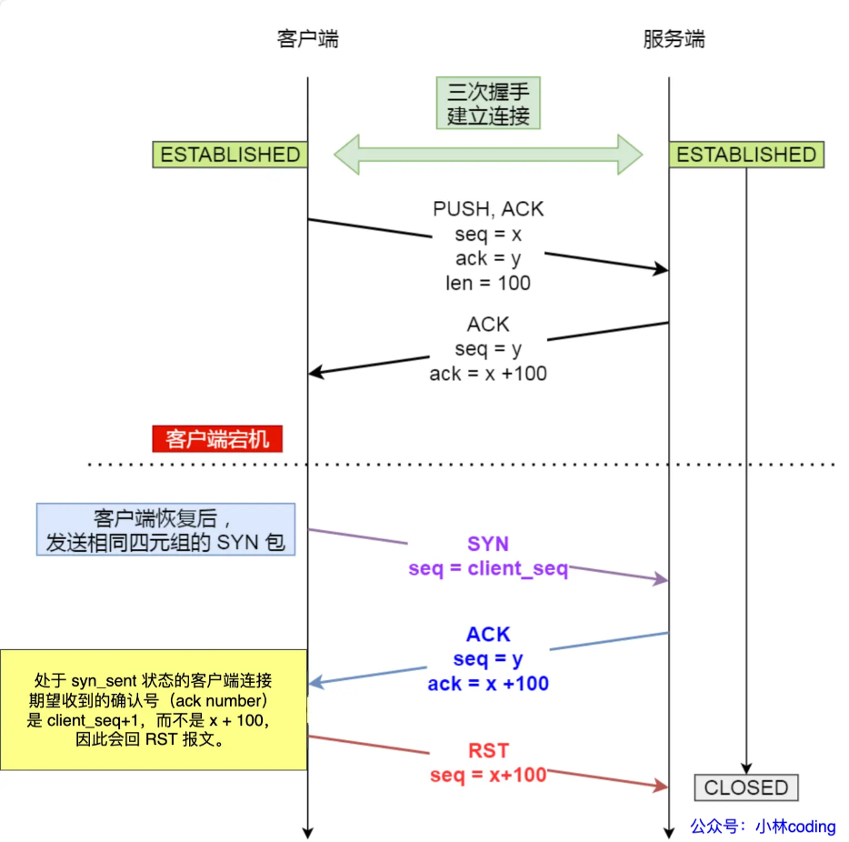

## TCP blocks

### 定义
TCP是基于IP（不稳定传输协议）上的一层协议，采用了一些关键的机制来确保数据能够稳定传输

### TCP的建立和销毁

#### TCP的三次握手机制

tcp的三次握手机制并不是特有的，本质上是`two general problem`，在一个`不可靠的信道`建立`可靠的双向传输`，最少需要三次信息交流。任何想要达成这个目的的协议，均需要三次握手，此问题并非TCP独有

细节：
A -> B (A发送SYN信号到B，等待B的ACK信息，若一定时间内未收到改信息，则超时重发ACK)

B -> A (B收到ACK后，发送自己的SYN和ACK信号，SYN和ACK合并发送，节省了一次传输)

A -> B (A收到B的ACK信号后，可以认为A->B的传输通道已经建立，可以发送DATA到B。因为双向连接，A还需要针对B的SYN信号做出回应，需发送ACK信号来告诉B）

tcp需要三次握手的理由
- 避免历史连接
- tcp通信的双方都需要维护一个序列号，序列号有如下的作用
  - 接收方可以去除重复的数据
  - 接收方可以根据序列号按序接收
  - 可以标识发出去的数据包中，哪些是对方已经收到的
- 避免资源的浪费，如果没有三次握手机制，对于客户端来的信号，服务端无脑建立连接浪费资源

避免历史连接、避免浪费资源，有如下的场景，client 发送SYN=90的信号，SYN=90信号在网络中阻塞了，client宕机。client重新连接的时候，发送SYN=100的信号，服务端先接收到SYN=90信号，发送ACK=91二次确认，由于有client端宕机后重新发送了信号，所以不会确认ACK=90，而是发送关闭历史连接（SYN=90）的信号RST，如果是两次握手的话，SYN=90的信号的连接就会被建立。这个也是资源的浪费。

这里有另外一种情况，就是如果先收到了SYN=100的信号，建立连接以后又收到了SYN=90的信号，这种情况下属于`已经建立连接的tcp重新收到了SYN`
- client的SYN端口和以前不同，会重新建立三次握手连接
  - server给client发数据，但是client已经关闭了，所以内核发送RST结束信号
  - server一直没有给client发数据，一段时间后TCP包活机制触发，server资源释放
- client端的报文的端口号和历史连接相同，有如下机制

处于 Established 状态的服务端，如果收到了客户端的 SYN 报文（注意此时的 SYN 报文其实是乱序的，因为 SYN 报文的初始化序列号其实是一个随机数），会回复一个携带了正确序列号和确认号的 ACK 报文，这个 ACK 被称之为 Challenge ACK。

接着，客户端收到这个 Challenge ACK，发现确认号（ack num）并不是自己期望收到的，于是就会回 RST 报文，服务端收到后，就会释放掉该连接。

#### tcp的fast open
tcp的fast open可以绕开tcp的三次握手机制，但是这个是*建立在第二次通信*的基础上，首次通信的时候，tcp仍然要进行三次握手的机制。机制如下
1. client发送SYN，同时开启fast open选项，cookie为空，需要server端注入fast open cookie
2. 支持tcp fast open的server，回复ACK，注入cookie
3. client收到SYN-ACK信号以后，本地缓存fast open的cookie

二次发送的时候有如下的机制
1. client发送SYN，携带cookie以及应用的data数据
2. server验证fast open的cookie
  - cookie有效，data交付给应用程序，可以回复SYN-ACK + 应用程序返回数据
  - cookie无效，只回复SYN-ACK
3. client收到数据，如果包含应用数据，正常发送，如果不包含那么再次发送应用data

#### tcp的四次挥手
tcp的四次挥手对应着连接断开，由于tcp是双向数据发送，断开连接的时候，需要client、server端分别断开，
1. client发送TCP首部的FIN为1，FIN报文，client进入FIN_WAIT_1
2. server发送ACK应答信号，进入CLOSE_WAIT
3. client收到ACK，进入FIN_WAIT_2
4. server处理完成数据后，也向客户端发送FIN报文，进入LAST_ACK
5. client收到FIN之后，发送ACK，同时自身进入TIME_WAIT
6. server收到ACK后，进入CLOSE，server端成功关闭连接
7. client在2MSL后，自动进入CLOSE

ACK信号是不会重新传输的，如果有一端迟迟收不到ACK信号，会触发超时重传的机制，会重新发送SYN信号，如果一直到收不到ACK，会在一段时间后直接进入到关闭的状态

### 流控制（Flow control）
流控制主要是为了防止sender发送数据过快过多，receiver来不及处理这些数据

#### receive window size(rwnd)
接收方在传递ACK信号的同时，会向发送方传递一个receive window size来告知sender自己能接受的数据大小，sender依赖这个值来调整传输数据的量。操作系统会有一个rwnd的`最大建议值(65535 bytes)`

#### Window scale
tcp最大的传输受限于min(rwnd, cwnd)，随着网络质量的提高，过小的rwnd会限制tcp的输出速率。

现在的操作系统允许扩大rwnd的最大值，从65535 bytes到1GB。能有效地利用网络带宽

### Slow-start and Congestion Avoidance
慢启动和阻塞控制算法是为了解决端到端经历的网络速率不足的问题。

#### Congestion window size(cwnd)
cwnd不是一个固定值，它是为了估计网络速率而存在的，**网络速率是动态变化的，所以cwnd也是动态变化的**

cwnd是对sender的限制，在接收到receiver的ACK信号前，sender发送数据的大小不能超过cwnd限制大小

cwnd采用的策略是**指数增长**，当sender正常收到receiver的ACK信号之后，sender会将自身的cwnd * 2，指导遇到packet loss，这个时候congestion avoidance算法开始介入

#### Congestion Avoidance
如何判断网络是否是堵塞的：当packet loss的时候，可以认定网络发生了堵塞

AIMD算法：当网络发生堵塞的时候，将cwnd减半，然后每轮roundtrip通过一个线性增长因子来扩大cwnd。这个算法比较保守。

PRR算法：比AIMD算法激进一些，减少3–10%的平均时延（Latency）

### Bandwidth-Delay
BDP = roundtrip Latency * link capacity (暂时不太理解)

假设tcp的window size(min(cwnd, rwnd)) 为16KB roundtrip Latency = 100ms，那么数据的传输速率为

16KB = (16 * 1024 * 8) = 131072 bits

传输速率 = 131072 bits / 0.1s = 1.31Mbps.

也就是说无论网络的带宽是多少，传输速率被限制在1.31Mbps

### Head-of-Line Blocking

TCP会将数据分成好些segment进行发送，tcp协议保证了数据的准确性、顺序性。对于上层应用而言，只要从socket读取数据即可。但是从socket读取数据读取的是由**tcp**合并好的数据，可能会包含多个segment。如上图，当p3、p2到达，而p1未到达的时候，上层应用是无法读取到数据的。只有等待p1 segment到达之后，才可以，这种现象被称为头部阻塞。

### tcp优化
tcp配置项和算法复杂多样，难以有通用的优化算法，但是不同版本的tcp协议都遵循了以下几个原则

- tcp建立的三次握手
- tcp的慢启动机制
- tcp的流量控制（Flow control）和阻塞控制（congestion control）
- tcp的速率由当前的window size来决定

#### server端优化
对于server端而言，最简单的优化方式是更新服务器OS的版本

以下是几个优化case
- Increasing TCP’s Initial Congestion Window
- Slow-Start Restart： 当tcp长连接的时候，禁用slow-start能提高tcp的性能
- Window Scaling (RFC 1323)
- TCP Fast Open

#### 对于client端的优化
- tcp连接的reuse，类比（connection: keep-alive）
- 少请求一些不必要的数据
- 物理上离服务器近一些（如cdn服务）
